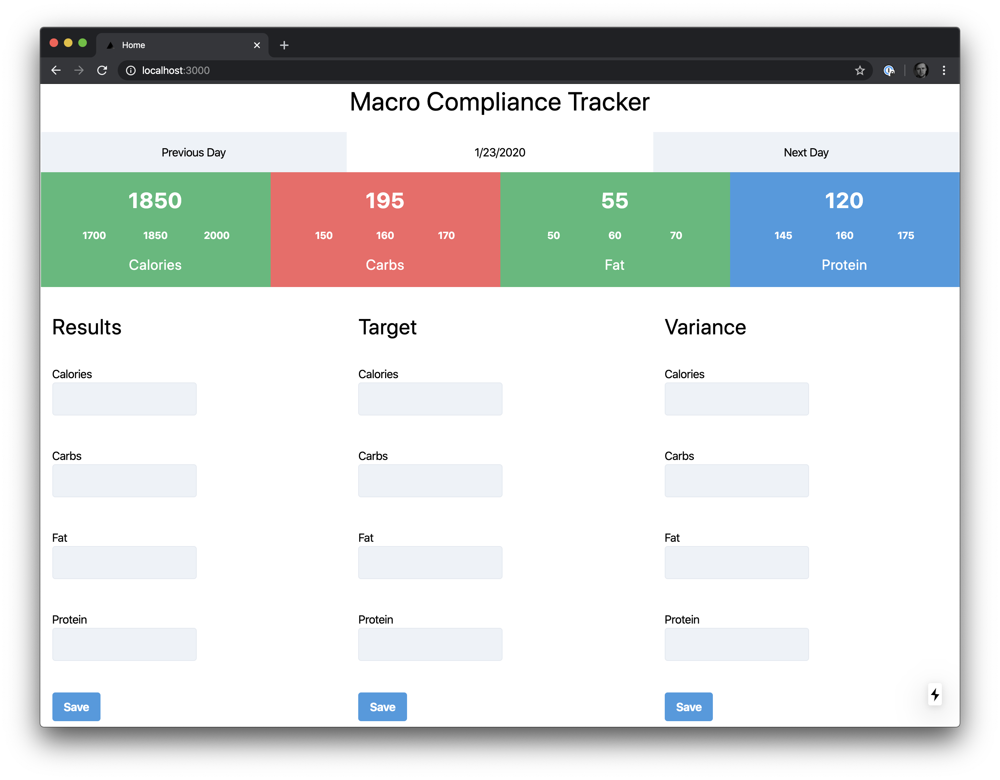

## Munch
App allows you to track your calories and macros, as well as acceptable ranges to be in compliance.

## Tools
NextJS + MongoDB

## Prerequisites

- A recent version of Node.js.
- MongoDB. Try [MongoDB Atlas](https://www.mongodb.com/download-center) for free. You can use code **ADO200** for a $200 credit.

If you want to add sample data. You can find it in the included [data.json](./mct/data.json) file. Import it into your database.

## Building the Application

1. Clone the repo
2. Navigate to the `mct` directory.
3. Run `npm install` in your terminal to install dependencies.
4. Run `npm run dev` to start the local development server.
5. Update the `{YOUR-MONGODB-CONNECTION-STRING}` string in the `database.js` file located in the `middleware` directory with your MongoDB connection string.
6. Ensure the `client.db('{DATABASE-NAME}')` string in the `database.js` file matches the database name you wish to use.

Navigate to `localhost:3000` to see your application in action. 
